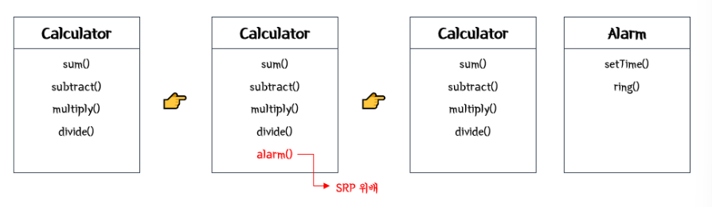
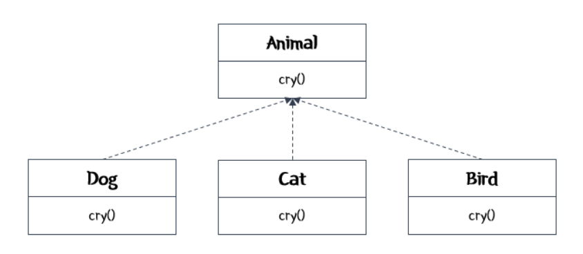
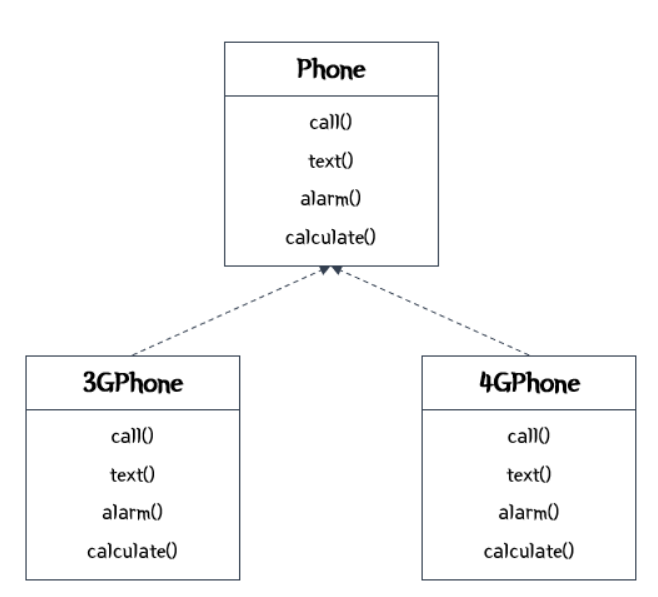
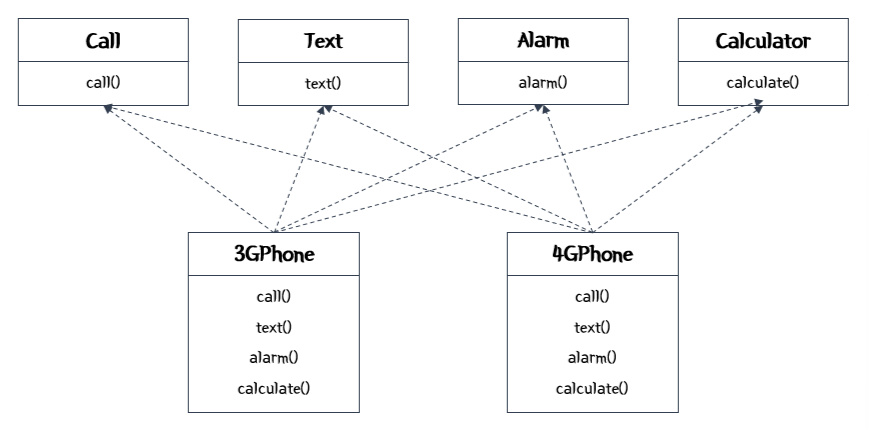
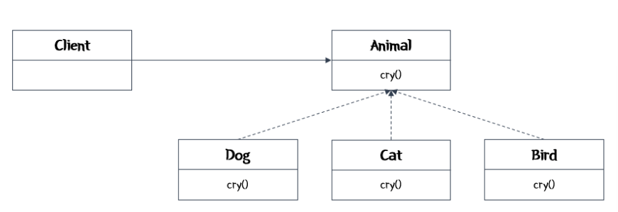
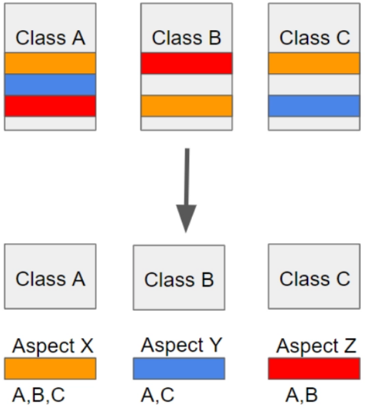

### SOLID 원칙?

- 객체지향 프로그래밍 및 설계의 기본 원칙

### 1) SRP (Single Responsibility Principle)

- 단일 책임 원칙
- **한 객체는 단 하나의 책임**만 가져야 함.
- 객체지향적으로 설계할 때는 응집도는 높게, 결합도는 낮게 설계.
- 객체에 책임이 많아질수록 객체 내부에서 서로 다른 역할을 수행하는 코드끼리 강하게 결합할 가능성이 높아짐.
- 객체마다 책임을 제대로 나누지 않으면 시스템은 매우 복잡해짐.
    - 객체가 하는 일에 변경이 있을 때에 해당 기능을 사용하는 부분을 모두 다시 테스트해야 되기 때문.
    - 그러므로, 한 객체가 다른 하나의 일만 가지도록 분배하면 시스템에 변화가 생겨도 그 영향을 최소화할 수 있음.

### Example)

- **Calculator** 객체는 덧셈, 뺄셈, 곱셈, 나눗셈만 할 수 있다. 👉 사칙연산에 대한 책임만 가지고 있다.
- 이때, 계산기에 알람을 추가한다.
- 만약, **Calculator**의 기능으로 **alarm()**을 추가하면 SRP에 위배된다.
- 따라서, **Calculator** 객체 외에 **Alarm** 객체를 생성해줘야 한다.



### 2) OCP (Open-Closed Principle)

- 개방-폐쇄 원칙
- **확장에 대해서는 개방적, 변경에 대해서는 폐쇄적**이어야 함.
- 기존 코드에 기능은 추가하되 기존 코드는 변경하지 않는 설계가 되어야 함.

### Example)

- **Animal** 인터페이스를 구현하는 Dog, Cat, Bird 클래스는 **cry()**를 재정의한다.
- 이처럼 캡슐화를 하면, 동물이 추가돼도 **cry()**를 호출하는 부분은 수정하지 않아도 쉽게 확장할 수 있다.



### **3) LSP (Liskov Substitution Principle)**

- 리스코프 치환 원칙
- **자식 클래스는 최소한 부모 클래스에서 가능한 행위를 수행할 수 있어야 함.**
- 자식 클래스는 부모 클래스의 역할을 대체할 수 있어야 함.
- **자식 클래스는 부모 클래스의 책임을 무시하거나 재정의하지 않고, 확장만 수행**

### 4) ISP **(Interface Segregation Principle)**

- 인터페이스 분리 원칙
- **클래스는 자신이 사용하지 않는 인터페이스는 구현하지 말아야 함.**
- 하나의 거대한 인터페이스보다 여러 개의 구체적인 인터페이스가 나음.

> SRP가 객체의 단일 책임을 뜻하면, ISP는 인터페이스의 단일 책임을 뜻함.
>

### **Example)**

- **Phone**에는 call, text, alarm, calculate 기능이 있다.
- **3GPhone**과 **4GPhone**은 해당 기능들을 사용한다.
- 만약, **Phone** 인터페이스에 해당 기능들을 정의하면 ISP에 위배된다.



- **Phone** 인터페이스에 모든 함수를 정의하지 않고, **Call**, **Text**, **Alarm**, **Calculator** 인터페이스에 각 함수를 정의하고 각 클래스에서 각각의 인터페이스를 구현하도록 설계하면 ISP를 만족한다.
- 결국, 각 인터페이스의 각 메소드가 서로 영향을 미치지 않게 된다.
- 따라서, 클래스는 자신이 사용하지 않는 메소드에 대해서 영향력이 줄어들게 된다.



### **5) DIP (Dependency Inversion Principle)**

- 의존 역전 원칙
- **의존 관계는 변화하기 어렵거나 변화가 거의 없는 것과 맺어야 함**.
- 객체들이 서로 정보를 주고 받을 때 의존 관계가 형성되는데, 이때 객체들은 추상성이 낮은 클래스보다 추상성이 높은 클래스와 의존 관계를 맺어야 함.
- 일반적으로 **인터페이스**를 활용하면 이 원칙을 준수할 수 있음.

### Example

- **Client** 객체는 Dog, Cat, Bird의 **cry()**에 직접 접근하지 않는다.
- **Animal** 인터페이스의 **cry()**를 호출하면서 DIP를 만족한다.



- **DI란?**

  ### DI (Dependency Injection) 의존성 주입

  - 외부에서 두 객체 간의 관계를 결정해주는 디자인 패턴으로, **인터페이스를 사이에 둬서 클래스 레벨에서는 의존관계가 고정되지 않도록 하고 런타임 시에 관계를 동적으로 주입**하여 유연성을 확보하고 결합도를 낮출 수 있게 함.

  ### 의존성 주입이 필요한 이유

  - 예를 들어서 연필이라는 상품과 1개의 연필을 판매하는 Store 클래스가 있음.

    ```java
    public class Store {
    	private Pencil pencile;
    	public Store() {
    			this.pencil = new Pencil();
    	}
    }
    ```

  - 위와 같은 예시 클래스는 크게 두가지 문제점을 가지고 있음.
    - 두 클래스가 강하게 결합되어 있음
      - 두 클래스가 강하게 결합되어 있어서 만약 Store에서 Pencil이 아닌 Food와 같은 다른 상품을 판매하고자 한다면 Store 클래스의 생성자에서 변경이 필요 → 유연성이 떨어짐
      - 각각의 다른 상품을 판매하기 위해 생성자만 다르고 나머지는 중복되는 Store 클래스들이 파생되는 것은 좋지 못함.
    - 객체들 간의 관계가 아니라 클래스 간의 관계
      - 위의 Store와 Pencil 객체들 간의 관계가 아니라 클래스들 간의 관계가 맺어져 있다는 문제가 있음. 객체들 간에 관계가 맺어졌다면 다른 객체의 구체 클래스(Pencil인지 Food 인지 등)을 전혀 알지 못하더라도, 해당 클래스가 인터페이스를 구현했다면 인터페이스의 타입으로 사용할 수 있다.

  ### 의존성 주입을 통한 문제 해결

  - 위와 같은 문제를 해결하기 위해서는 다형성이 필요
  - Pencil, Food 등 여러가지 제품을 하나로 표현하기 위해서는 Product 라는 Interface가 필요.

    ```java
    public interface Product { }
    public class Pencil implements Product { }
    ```

  - 강한 결합 제거. 이를 제거하기 위해서는 외부에서 상품을 주입 받아야함.
  - 그래야 Store에서 구체 클래스에 의존하지 않게 됨

    ```java
    public class Store {
    	private Product product;
    	public Store(Product product) {
    		this.product = product;
    	}
    }
    ```

  - 이러한 이유로 Spring이라는 DI 컨테이너가 필요함. Store에서 Product 객체를 주입하기 위해서는 애플리케이션 실행 시점에 필요한 객체(빈)를 생성해야하며, 의존성이 있는 두 객체를 연결하기 위해 한 객체를 다른 객체로 주입 시켜야 함.

    ```java
    public class BeanFactory {
    	public void store() {
    		//Bean의 생성
    		Product pencil = new Pencil();
    		
    		//의존성 주입
    		Store store = new Store(pencil);
    	}
    }
    ```

- **IoC란?**

  ### IoC(Inversion of Control)

  - 제어의 역전이라는 의미로, 객체의 생성과 생명 주기의 제어를 개발자가 아닌 프레임워크 (즉, 스프링 컨테이너)가 담당하게 하는 것.

  ### IoC 컨테이너

  - Spring의 IoC 컨테이너는 애플리케이션의 구성 요소를 생성하고 관리하며, 이를 애플리케이션 실행 중 필요한 곳에 제공.
  - **BeanFactory:** 기본 IoC 컨테이너로, 초기화 속도가 빠름
  - **ApplicationContext:** BeanFactory를 확장한 컨테이너로, 더 많은 기능을 제공
    - 예) 이벤트 처리, 국제화 지원(MessageSource) 등
  - 역할
    - **객체의 생성 및 관리**
      - ApplicationContext를 사용하여 빈(Bean)을 생성하고 관리
      - 빈은 일반적으로 Spring이 제어하며, 개발자는 객체의 생성과 관리를 직접 처리하지 않음
    - **의존성 관리**
      - 객체 간의 의존성을 Spring이 주입(DI)
      - 객체가 필요로 하는 다른 객체를 직접 생성하거나 찾는 대신, Spring 컨테이너가 의존성을 주입
    - **제어 흐름의 역전**
      - 개발자가 코드의 제어 흐름을 결정하지 않고, 프레임워크가 객체의 라이프사이클 및 실행 흐름을 관리

  ### IoC의 작동 원리

  - 개발자는 객체의 생성 방식을 정의하지 않고, 필요한 객체의 요청만 함
  - IoC 컨테이너가 객체를 생성하고 필요한 의존성을 주입
  - 개발자는 컨테이너가 제고하는 객체를 사용하기만 하면 됨
- **생성자 주입 vs 수정자, 필드 주입 차이는?**

  ### 1) 생성자 주입

  - 객체의 생성자를 통해 의존성을 전달받는 방식
  - 주입이 필수적인 의존성일 때 가장 적합
  - Spring 컨테이너는 객체를 생성할 때 생성자를 호출하며, 이 과정에서 의존성을 주입
  - 장점
    - 객체 생성 시 필수 의존성을 보장할 수 있음
    - 주입된 의존성을 변경할 수 없기 때문에 불변 객체를 만들기에 적합

    ```java
    @Service
    public class OrderService {
        private final MemberService memberService;
    
        public OrderService(MemberService memberService) {
            this.memberService = memberService;
        }
    }
    ```

  ### 2) 수정자 주입

  - setter 메서드를 통해 의존성을 주입하는 방식
  - 선택적인 의존성이 필요한 경우나 객체 생성 후 추가적으로 설정해야 할 작업이 있을 때 주로 사용
  - Spring 컨테이너는 객체를 생성한 후, setter 메서드를 호출하여 의존성을 주입

    ```java
    @Service
    public class OrderService {
        private MemberService memberService;
    
        @Autowired
        public void setMemberService(MemberService memberService) {
            this.memberService = memberService;
        }
    }
    ```

  ### 3) 필드 주입

  - 클래스의 필드에 직접 의존성을 주입하는 방식
  - @Autowired 또는 @Inject를 필드에 붙여 간단히 사용
  - but, 테스트와 유지보수성이 떨어지고, 주입된 의존성을 명확히 확인하기 어렵기 때문에 권장되지 않는 방식

    ```java
    @Service
    public class OrderService {
        @Autowired
        private MemberService memberService;
    }
    ```

  | 생성자 주입 | 수정자 주입 | 필드 주입 |
      | --- | --- | --- |
  | 생성 시점에 주입 | 생성 후 주입 | 필드에 바로 주입 |
  | 필수 의존성에 적합 | 선택 의존성에 적합 | 간단하지만 테스트/유지보수에 불리 |
  | 불변성 보장 가능 | 변경 가능성 있음 |  |
  | 가장 권장 |  | 실무에서는 보통 비추천 |
- **AOP란?**

  ### AOP(Aspect Oriented Programming) 관점 지향 프로그래밍

  - 어떤 로직을 기준으로 핵심적인 관점, 부가적인 관점으로 나눠서 보고 그 관점을 기준으로 각각 모듈화하겠다는 것.
  - 모듈화 : 어떤 공통된 로직이나 기능을 하나의 단위로 묶는 것

  - AOP에서 각 관점을 기준으로 로직을 모듈화한다는 것은 코드들을 부분적으로 나누어서 모듈화 하겠다는 의미
  - 이때 소스 코드상에서 다른 부분에 계속 반복해서 쓰는 코드들을 발견할 수 있는데 이것들을 **흩어진 관심사(Crosscutting Concerns)** 라 함



  - 위와 같이 흩어진 관심사를 Aspect로 모듈화하고 핵심적인 비즈니스 로직에서 분리하여 재사용하겠다는 것이 AOP의 취지.

  ### AOP 주요 개념

  - Aspect: 위에서 설명한 흩어진 관심사를 모듈화 한 것. 주로 부가기능을 무듈화함.
  - Target: Aspect를 적용하는 곳 (클래스, 메서드 … )
  - Advice: 실질적으로 어떤 일을 해야할 지에 대한 것, 실질적인 부가기능을 담은 구현체
  - JointPoint: Advice가 적용될 위치, 끼어들 수 있는 지점. 메서드 진입 지점, 생성자 호출 지점, 필드에서 값을 꺼내올 때 등 다양한 시점에 적용 가능.
  - PointCut: JoinPoint의 상세한 스펙을 정의한 것. ‘A란 메서드의 진입 시점에 호출할 것’ 과 같이 더욱 구체적으로 Advice가 실행될 지점을 정할 수 있음.

  ### AOP 특징

  - 프록시 패턴 기반의 AOP 구현체, 프록시 객체를 쓰는 이유는 접근 제어 및 부가기능을 추가하기 위해서임
    - 프록시: 원래 객체 앞에 하나 더 끼워서, 대신 요청을 받고 넘겨주는 것.
  - 스프링 빈에만 AOP를 적용 가능
  - 모든 AOP 기능을 제공하는 것이 아닌 스프링 IoC와 연동하여 엔터프라이즈 애플리케이션에서 가장 흔한 문제 (중복코드, 프록시 클래스 작성의 번거로움, 객체들 간 관계 복잡도 증가.. ) 에 대한 해결책을 지원하는 것이 목적
- **서블릿이란?**

  ### 서블릿(Servlet)이란?

  - 자바 기반의 웹 서버 애플리케이션 기술로서, 웹 페이지를 동적으로 생성하는 웹 컴포넌트

  ### 특징

  - 자바 기반의 웹 컴포넌트로서 java 확장자를 가짐
  - 클라이언트의 요청에 의해서 동적으로 실행. 따라서 다양한 클라이언트 요구 사항을 처리할 수 있음
  - 서블릿은 웹 컨테이너에 의해서 관리되며, 스레드로 동작되어 효율적인 요청처리가 가능
  - MVC 패턴의 Controller 역할로서 서블릿이 사용
    - MVC(Model View Controller) : 데이터 처리 / 화면 / 요청 제어를 나누어서 만드는 방식
  - 서블릿 하나는 하나의 클래스로서, javax.servlet.http.HttpServlet 클래스를 상속 받아 구현해야 함. HttpServlet에는 웹상에서 클라이언트 요청이 있을 때 해당 서블릿을 실행하는 모든 조건이 포함.

  ### 서블릿 컨테이너 (Container)

  - 컨테이너는 웹 컴포넌트를 저장하는 저장소 역할, 메모리 로딩, 객체 생성 및 초기화 등 서블릿의 생명주기를 관리하고 JSP를 서블릿으로 변환하는 기능을 수행하는 프로그램
  - 서블릿 컨테이너는 서블릿 컴포넌트를 실행하는 환경을 제공
  - 클라이언트의 HTTP 요청을 서블릿에 전달하고, 서블릿의 HTTP 응답 결과를 클라이언트에 돌려줌
  - 서블릿 엔진이라고도 함