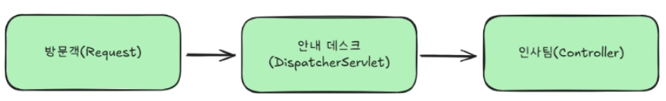

### 워크북 캡쳐

유리 -> 에반


### 워크북 리뷰
서블릿 메서드에 대해서 잘 몰랐는데 정리를 해주신 덕분에 알게되는 계기가 되었다.


### DispatcherServlet이란?

- 배달하는(Dispatch) 서블릿
- 모든 요청을 가장 먼저 받아서 적절한 곳으로 배달해주는 중앙 관제탑 같은 역할
- ex)
    - 방문객이 오면 안내 데스크에서 먼저 접수 → 방문객이 ‘인사팀을 찾아왔어요’ 라고 하면, 안내 데스크 직원이 인사팀이 몇 층 몇 호인지 찾아서 안내
    - DispatcherServlet이 안내 데스트 역할



- Spring MVC에서는 모든 HTTP 요청이 먼저 DispatcherServlet을 거침
- DistpatcherServlet은 요청 URL을 보고 ‘이 요청은 어떤 Controller가 처리해야 하지? ‘를 판단하여 적절한 곳을 보내줌

### 왜 DispatcherServlet이 필요?

- 만약 DispatcherServlet 없이 각 Controller가 직접 요청을 받는다면?


- Controller가 10개면 서블릿도 10개, 100개면 100개를 등록해야 함.
- 공통 로직 (인코딩 설정, 에러처리 등)도 각각 구현해아 함.
- ⇒ DispatcherServlet은 **하나의 진입점**에서 모든 요청을 받고, 공통 처리를 한 번에 적용한 뒤, 적절한 Controller로 분배. → Front Controller 패턴이라고 부름


### 요청이 응답 되기까지의 전체 흐름


### 1단계: 요청 수신(DispatcherServlet)

- 클라이언트가 GET /users/1 요청을 보냈다고 가정

```java
GET /users/1 HTTP/1.1
HOST: localhost:8080
```

- 이 요청은 먼저 DispatcherServlet에 도착
- DistpatcherServlet은 요청을 받으면 “GET /users/1 요청이 들어왔으며 이것을 처리할 수 있는 Controller가 누구인지” 를 생각함


### 2단계: 핸들러 찾기 (HandlerMapping)

- DispatcherServlet은 HandlerMapping에게 “이 요청을 처리할 수 있는 핸들러(Controller)가 누구인지” 물어봄

```java
@RestController
@RequestMapping("/users")
public class UserController {

    @GetMapping("/{id}")
    public User getUser(@PathVariable Long id) {
        return userService.findById(id);
    }
}
```

- HandlerMapping은 등록된 Controller들의 `@RequestMapping` 정보를 뒤져서, `/users/1` 요청을 처리할 수 있는 메서드를 찾음

### 3단계: 핸들러 실행 (HandlerAdapter)

- 핸들러를 찾았으면 실행. 핸들러의 형태가 다양할 수 있음

```java
// 형태 1: @Controller 어노테이션 방식
@Controller
public class UserController { ... }

// 형태 2: Controller 인터페이스 구현 방식 (옛날 방식)
public class OldController implements Controller { ... }
```

- DispatcherServlet이 이 모든 형태를 직접 처리하면 코드가 복잡
- 그래서 **HandlerAdapter**가 중간에서 실행을 대신해줌
- HandlerAdapter는 핸들러의 형태에 맞는 방식으로 메서드를 호출
- 어댑터 패턴을 사용해서 DispatcherServlet은 핸들러가 어떤 형태든 신경 쓰지 않아도 됨

### 4단계: Controller 실행

- 작성한 **Controller**가 실행

```java
@GetMapping("/{id}")
public User getUser(@PathVariable Long id) {
    // 비즈니스 로직 실행
    return userService.findById(id);
}
```

- Controller에서는 Service를 호출하고, Service는 Repository를 통해 데이터베이스에서 데이터를 가져옴. 이 과정은 개발자가 직접 작성하는 부분

### 5단계: View 결정 (ViewResolver)

- Controller가 View 이름을 반환했다면, **ViewResolver**가 실제 View 파일을 찾음

```java
@Controller
public class UserController {

    @GetMapping("/users/{id}")
    public String getUser(@PathVariable Long id, Model model) {
        User user = userService.findById(id);
        model.addAttribute("user", user);
        return "user/detail";  // View 이름 반환
    }
}
```

### **6단계: View 렌더링**

- **View**는 최종 HTML을 생성

```java
<!-- /templates/user/detail.html -->
<!DOCTYPE html>
<html>
  <body>
    <h1 th:text="${user.name}">사용자 이름</h1>
    <p th:text="${user.email}">이메일</p>
  </body>
</html>
```

- View는 Controller에서 Model에 담아준 데이터(`user`)를 사용해서 동적으로 HTML을 생성
- 이렇게 생성된 HTML이 최종 HTTP 응답